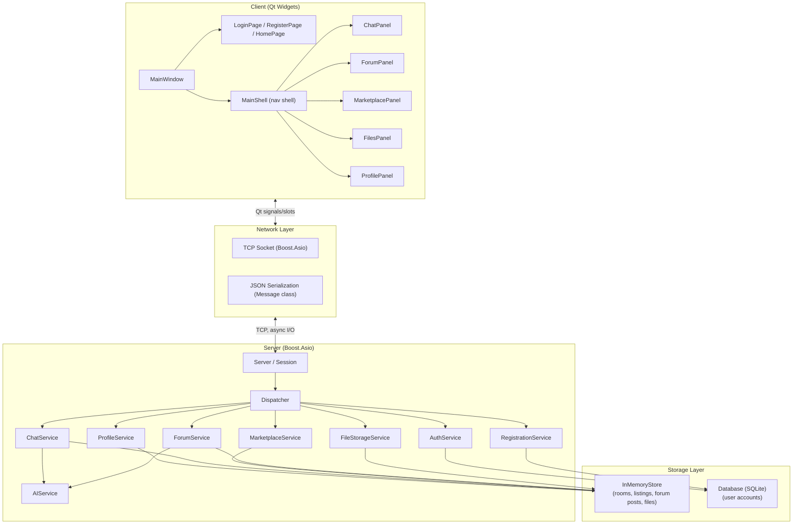

# AUC Network — Architecture

## Overview

AUC Network is a client-server desktop application. The client (Qt GUI) and
server (Boost.Asio) communicate over TCP using JSON-serialized messages. The
server keeps user accounts in a SQLite database and keeps chat rooms,
listings, forum posts, and files in memory for the current session.

## System Diagram

## Layers

**Client (Qt Widgets)** — `client/ui/`. `MainWindow` hosts either the
authentication pages (`LoginPage`, `RegisterPage`, `HomePage`) or, once
logged in, `MainShell`, which hosts the feature panels (`ChatPanel`,
`ForumPanel`, `MarketplacePanel`, `FilesPanel`, `ProfilePanel`) as tabs.
GUI code never touches sockets directly — it only builds `Message` objects
and connects to Qt signals/slots.

**Networking** — `shared/` and the client/server networking folders. Every
action (login, post a listing, send a chat message) is represented as a
`Message` struct, which is serialized to JSON before being sent over a TCP
socket managed by Boost.Asio, and deserialized back into a `Message` on the
receiving end.

**Server** — `server/networking/` and `server/services/`. `Server` accepts
connections and hands each one to a `Session`. Every incoming `Message` is
handed to the `Dispatcher`, which checks authentication and routes it to the
correct service (`AuthService`, `ChatService`, `MarketplaceService`,
`ForumService`, etc.) based on the message type. `AIService` is used by
`ChatService` (chat summarization) and `ForumService` (AI-suggested
answers).

**Storage** — `server/store/`. User accounts are persisted in a SQLite
database via `Database`. Everything else (chat rooms, listings, forum
questions/answers, uploaded files) lives in `InMemoryStore` for the current
server run.
